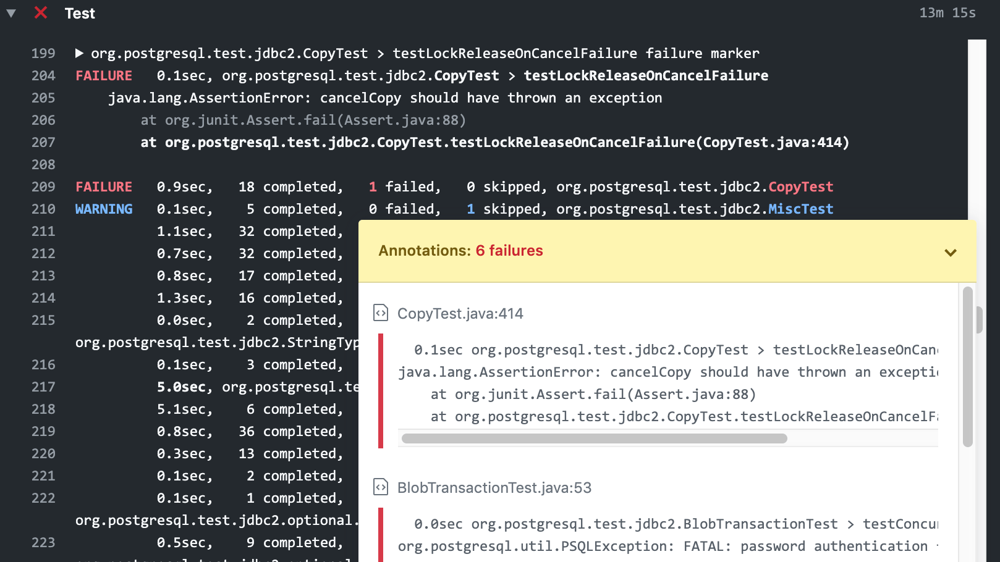

[](https://github.com/vlsi/vlsi-release-plugins/actions)

About
=====

This is a set of Gradle plugins to simplify release tasks

Checksum Dependency Plugin
==========================

Enables to validate the checksums of the project dependencies (both plugins and regular dependencies).
Note: this plugin has nothing to do with generating checksums.
What it does it prevents man-in-the middle attack by enabling developers
to declare the expected checksums.

See [checksum-dependency-plugin description](plugins/checksum-dependency-plugin/README.md) for installation and configuration options.

Jandex Gradle Plugin
====================

Allows building [Jandex](https://github.com/wildfly/jandex) class index.
An alternative use case is verification of the class files: if `jandex` fails to parse the file,
then the bytecode might be invalid.

See [jandex-plugin description](plugins/jandex-plugin/README.md) for configuration options.

Stage Vote Release Plugin
=========================

Enables to stage and vote on release artifacts before they are released.

See [stage-vote-release-plugin description](plugins/stage-vote-release-plugin/README.md) for configuration options.

Gradle Extensions Plugin
========================

See [gradle-extensions-plugin description](plugins/gradle-extensions-plugin/README.md) for configuration options.

Enables to access `Project` properties in a type-safe way:

```kotlin
val skipJavadoc by props()     // defaults to false
val enableTests by props(true) // defaults to true
val hello by props("world")    // defaults to "world"
if (project.props.bool("isOk", default=true)) { ... }
```

It improves test output and build failures as well:


CRLF Plugin
===========

Adds Kotlin DSL to specify CRLF/LF filtering for `CopySpec`.
Enables to use `.gitignore` and `.gitattributes` for building `CopySpec`.

See [crlf-plugin description](plugins/crlf-plugin/README.md) for configuration options.


IDE Plugin
==========

* Configures copyright profile
* Configures "generated sources"
* Enables to configure "post import" tasks (== call task on project import to generate sources)

License Gather Plugin
=====================

The purpose of the plugin is to analyze and infer license names for the dependencies, and verify license compatibility.

See [license-gather-plugin description](plugins/license-gather-plugin/README.md) for configuration options.

Gettext Plugin
==============

The plugin adds the following task classes to execute `GNU gettext` binaries:

* `GettextTask` collects messages from the source files into `.pot`
* `MsgAttribTask` processes `.po` files (e.g. for removal of obsolete messages)
* `MsgMergeTask` updates `.po` files with missing messages from `.pot`
* `MsgFmtTask` generates the resource bundle (e.g. Java source files for the resources)

License
-------
This library is distributed under terms of Apache License 2.0

Change log
----------
v1.86
* checksum-dependency: use full fingerprint for PGP verification

v1.85
* licence-gather: better support for build cache by adding PathSensitivity
* checksum-dependency: cache PGP public keys under `%{ROOT_DIR}/gradle/checksum-dependency-plugin/cached-pgp-keys`
* checksum-dependency: bump org.bouncycastle:bcpg-jdk15on to 1.70

v1.84
* no-op release, since some of the plugins failed to publish to Gradle Plugin Portal in v1.83

v1.83
* stage-vote-release: bump grgit to 4.1.1

v1.82
* gradle-extensions: render class name for JUnit4 parameterized tests with several test methods (they treated as suites in Gradle 7)

v1.81
* jandex: add @IgnoreEmptyDirectories to fix Gradle 7 warning
* gettext: add @IgnoreEmptyDirectories to fix Gradle 7 warning

v1.80
* license-gather: use META-INF/licenses/$group/$module-$version for storing license files in jar
* jandex: support Gradle Configuration Cache

v1.79
* license-gather: avoid generating directories that end with .jar to workaround OpenJDK's JarIndex issue

v1.78
* chore: bump Gradle 6.7 -> 6.9.1
* license-gather: ignore xml namespaces when parsing POM files (see [issue #43](https://github.com/vlsi/vlsi-release-plugins/issues/43))
* license-gather: fix license inference from Bundle-License manifest attribute (see [issue #48](https://github.com/vlsi/vlsi-release-plugins/issues/48))
* license-gather: implement VerifyLicenseCompatibilityTask for verifying license compatibility (see [pr #49](https://github.com/vlsi/vlsi-release-plugins/pull/49))
* checksum-dependency: retrieve keys from https://keyserver.ubuntu.com, and https://keys.openpgp.org by default (drop SKS keyserver pool since it has been deprecated)

Thanks to [Florian Dreier](https://github.com/DreierF) for identifying bugs and suggesting fixes.

v1.77
* crlf-plugin: bump jgit to 5.13.0.202109080827-r
* stage-vote-release: bump jgit to 5.13.0.202109080827-r

v1.76
* jandex-plugin: workaround warnings with forbiddenApis and compileTestJava

v1.75
* crlf-plugin: remove input specification from FindGitAttributes task properties to workaround non-declared task dependency warning (see https://github.com/gradle/gradle/issues/18882)
* license-gather-plugin: support jars that have both /LICENSE and /META-INF/LICENSE files
* gradle-extensions: avoid printing stacktrace when Kotlin compilation fails
* gradle-extensions: avoid printing stacktraces for autostyle failures
* stage-vote-release: use task.state instead of archiveFile.exists() to skip sha512 and sign tasks
* jandex-plugin: add dependency for javadoc and sourcesJar tasks on processJandexIndex

v1.74
* checksum-dependency: skip checksum verification when artifact resolves to a directory
* stage-vote-release: add workaround for Gradle 7.0 compatibility (see https://github.com/gradle/gradle/issues/16777)

v1.73
* jandex-plugin: fixed "Task with name 'check' not found" when the plugin is applied with `plugins { ... }`

v1.72
* jandex-plugin: add `maxErrors` option to show several errors rather than stop on the first one
* gradle-extensions-plugin: fix output of exceptions with multiple nested suppressed exceptions

v1.71
* Add CI jobs with nightly and RC Gradle versions
* jandex-plugin: build class file index via [Jandex](https://github.com/wildfly/jandex) or verify the bytecode

v1.70
* stage-vote-release: fix Gradle 6.0 warnings

v1.69
* license-gather-plugin: fix ignoreMissingLicenseFor annotations

v1.68
* license-gather-plugin: remove @Internal annotation from ignoreMissingLicenseFor

v1.67
Same as 1.66 (re-published because 1.66 artifacts were corrupted by Gradle Plugin Portal issue)

v1.66
* gradle-extensions-plugin: MavenPom.simplifyXml() to trim scope=compile and dependencyManagement from pom.xml
* gradle-extensions-plugin: MavenPublication.versionFromResolution() to map versions in pom.xml to Gradle resolution results
* gradle-extensions-plugin: Project.extraMavenPublications() to add extra Maven publications (e.g. publish shadow jar)

v1.65
* stage-vote-release-plugin: add `nexus.connectTimeout` and `nexus.operationTimeout` with default of 15 minutes (Maven Central is slow at times)
* stage-vote-release-plugin: create rc and release tags only after artifacts are pushed to Nexus (e.g. if javadoc build fails, the tag is not required)
* gradle-extensions-plugin: skip stacktrace for TaskSelectionException [issue#35](https://github.com/vlsi/vlsi-release-plugins/issues/35)

v1.64
* stage-vote-release-plugin: upate nexus-staging 0.2.0 -> 0.4.0; gradle-nexus-staging-plugin 0.20.0 -> 0.21.2
* update jgit: 5.6.0.201912101111-r -> 5.6.1.202002131546-r
* update grgit: 3.1.1 -> 4.0.1

v1.63
* gradle-extensions-plugin: refine condition for stacktrace printing

v1.62
* gradle-extensions-plugin: add `DomainObjectCollection.configureEach<T>` extension
* gradle-extensions-plugin: reduce verbosity of the default exception printer (print only well-known exceptions and stacktraces by default like NPE)
* stage-vote-release-plugin: refine -Prc input parameter validation
* license-gather-plugin: refine `Apache2LicenseRenderer` to render custom licenses
* all plugins: publish to Maven Central with PGP signatures

v1.61
* gradle-extensions-plugin: significantly improve stacktrace formatting, add task failure summary
* checksum-dependency-plugin: removed http://keys.fedoraproject.org/ from keyserver list as it no longer works

v1.60
* gradle-extensions-plugin: add GitHub Actions error markers to test output
* gettext-plugin: cleanup Gradle annotations

v1.59
* Skipped

v1.58
* gradle-extensions-plugin: enable coloring in test results by default (`-Pnocolor`, `-Pnocolor=true|false`)

v1.57
* Add gettext-plugin
* Add `Test.printTestResults` (print test results, color output) function to gradle-extensions-plugin

v1.56
* Skipped

v1.55
* Build with Gradle 6.1.1

v1.54
* Replace Spotless -> [Autostyle](https://github.com/autostyle/autostyle) for simpler code style management
* Update org.eclipse.jgit: 5.4 -> 5.6
* stage-vote-release-plugin: fix race condition in nexus-publish afterEvaluate: provide username/password always
* stage-vote-release-plugin: generate description for nexus staging repository
* ide-plugin: update gradle-idea-ext: 0.5 -> 0.7

v1.53
* stage-vote-release-plugin: expose NexusConfig#mavenCentral to enable publishing to Central

v1.52
* stage-vote-release-plugin: integrate signing, and support skipSign and useGpgCmd properties

v1.51
* stage-vote-release-plugin: expose releaseParams.svnDistEnabled to skip SVN publication
* stage-vote-release-plugin: publish Git tag after publishing Nexus and SVN

v1.50
* stage-vote-release-plugin: expose releaseParams.gitRepoName to customize Git repository name

v1.49.0
* gradle-extensions-plugin: expose Project.props(Int), props(Long), props.string(...), props.int(...), props.long(...)
* gradle-extensions-plugin: change Project.lastEditYear to find the maximum 4-digit integer
* ide-plugin: expose ide.licenseHeader, ide.licenseHeaderJava, and ide.copyright(...). Fix default ASF copyright

v1.48.0
* stage-vote-release-plugin: workaround publishDist issue when SVN 1.9 is used

v1.47.0
* gradle-extensions-plugin: plugin for type-safe `Project` property access in `build.gradle.kts`

v1.46.0
* stage-vote-release-plugin: avoid failures in pushPreviewSite on Gradle version upgrade
* stage-vote-release-plugin: allow uncommitted changes for generateVoteText / publishDist
* crlf-plugin: fix handling of `.gitignore` files in subfolders

v1.45.0
* stage-vote-release-plugin: preserve `**/.git/**` in syncPreviewSiteRepo
* stage-vote-release-plugin: avoid NPE in GitPushTask when pushing new tag
* stage-vote-release-plugin: avoid rebuilding artifacts for generateVoteText/publishDist (fetch files from SVN dist)
* ide-plugin: support generatedJavaSources for different sourceSets (main, test)
* license-gather-plugin: use Gradle 7-compatible API workerExecutor.noIsolation instead of .submit

v1.44.0
* stage-vote-release-plugin: disable automatic execution of removeStaleArtifacts when publishing the release

v1.43.0
* stage-vote-release-plugin: support Gradle 6.0

v1.42.0
* stage-vote-release-plugin: fix logging in RemoveStaleArtifactsTask

v1.41.0
* stage-vote-release-plugin: implement removeStaleArtifacts task to cleanup dist.apache.org
* stage-vote-release-plugin: hide technical tasks
* stage-vote-release-plugin: improve logging in GitPushTask
* stage-vote-release-plugin: detect "stage SVN revision"

v1.40.0
* stage-vote-release-plugin: avoid including artifact name in ReleaseArtifact.getSha512

v1.39.0
* stage-vote-release-plugin: validate asfTest...Username and asfTest...Password properties

v1.38.0
* stage-vote-release-plugin: release tag should be created for release candidate commit, not the current HEAD

v1.37.0
* stage-vote-release-plugin: execute sha512 and signing tasks only when input files exist

v1.36.0
* checksum-dependency-plugin: use `MD5SUM` format for `.sha512` files so the checkums can be verified with `shasum -c *.sha512`

v1.35.0
* checksum-dependency-plugin: ignore unresovable dependencies (see https://youtrack.jetbrains.com/issue/KT-34394 )

v1.34.0
* crlf-plugin: proper support of absolute paths in non-root gitignore files

v1.33.0
* checksum-dependency-plugin: reduce verbosity by using the actual duration of "PGP key retrieval" to decide if the timeout is loggable or not
* stage-vote-release-plugin: treat generateVoteText as non-incremental task (avoid caching of the mails between rc1, rc2, and so on)
* stage-vote-release-plugin: skip SHA-512 computation when the original artifact task is skipped

v1.32.0
* stage-vote-release-plugin: add releaseArtifacts {...} extension to pass artifacts across Gradle's modules
* stage-vote-release-plugin: validate Git username/password before release starts

v1.31.0
* checksum-dependency-plugin: added `pgpMinLoggableTimeout` (default 4 seconds) to reduce the verbosity of the plugin
* checksum-dependency-plugin: added `checksumUpdateAll` property for simplified `checksum.xml` update without build failure

v1.30.0
* checksum-dependency-plugin: show PGP signature resolution time (#21)
* checksum-dependency-plugin: disable verification when `dependencyUpdates` task is present on the task execution graph (#20)

v1.29.0
* checksum-dependency-plugin: resolve and verify PGP in parallel, compute SHA in parallel

v1.28.0
* checksum-dependency-plugin: fix resolution of copied configurations (== fix compatibility with https://github.com/ben-manes/gradle-versions-plugin)
* checksum-dependency-plugin: add checksumIgnore property for disabling the plugin (e.g. when certain tasks are not compatible with verification)

v1.27.0
* checksum-dependency-plugin: support Gradle 4.4.1

v1.26.0
* checksum-dependency-plugin: fix logging for "PGP key...download time: 0ms"

v1.24.0
* checksum-dependency-plugin: failover across multiple keyservers and DNS responses

v1.23.0
* checksum-dependency-plugin: support Gradle 4.10.2

v1.22.0
* checksum-dependency-plugin: add `<ignored-keys>` to prevent resolution of known to be absent keys

v1.21.0
* checksum-dependency-plugin: PGP-based dependency verification (see [detailed description](plugins/checksum-dependency-plugin/README.md))

v1.20.0
* checksum-dependency-plugin: properly track `.pom` artifacts (and other non-jar artifacts with default classifier)

v1.19.0
* checksum-dependency-plugin: include `classifier` and `extension` to artifact key

v1.18.0
* checksum-dependency-plugin: improve logging

v1.17.0
* checksum-dependency-plugin: new plugin to verify the downloaded dependencies on resolution
* all plugins: remove Implementation-Version manifest attribute to make jars have
consistent checksums across versions
* stage-vote-release-plugin: make sitePreviewEnabled configurable via property

v1.16.0
* stage-vote-release-plugin: make -Prc optional for pushPreviewSite

v1.15.0
* stage-vote-release-plugin: validate Git credentials
* stage-vote-release-plugin: use $it-site.git and $it-site-preview.git name conventions

v1.14.0
* stage-vote-release-plugin: use property value instead of name for Git credentials

v1.13.0
* stage-vote-release-plugin: allow to publish to AFF repository via -Pasf

v1.12.0
* Add .editorconfig
* stage-vote-release-plugin: take RepositoryType.PROD/TEST from "asf" property
* stage-vote-release-plugin: add releaseParams.rc, releaseParams.release and releaseParams.committerId properties
* stage-vote-release-plugin: add GitCreateTagTask, GitPushTask
* stage-vote-release-plugin: add option to automatically generate SHA512
* stage-vote-release-plugin: allow to select between GitHub and GitBox push alternatives
* stage-vote-release-plugin: add pre-release validations
* stage-vote-release-plugin: create and push RC and Release tags
* stage-vote-release-plugin: add ReleaseExtension#componentName (a sub-component under TLP)
* stage-vote-release-plugin: load stagingRepositoryId for release task
* stage-vote-release-plugin: avoid parallel execution of initializeNexusStagingRepository to improve task concurrency
* ide-plugin: support generatedSources in Eclipse
* license-gather-plugin: exclude txt-based licenses from the jar to save some space

v1.11.0
* stage-vote-release-plugin: require Nexus username/password only when release task is used

v1.10.0
* stage-vote-release-plugin: fix asfSvnUsername should be used instead of asfasfSvnUsername

v1.9.0
* stage-vote-release-plugin: properly support username/password for Nexus and SVN
* stage-vote-release-plugin: make sitePreview optional

v1.8.0
* stage-vote-release-plugin: add ReleaseExtension#validateReleaseParams(Runnable) to enable fail-fast on releasing SNAPSHOT versions

v1.7.0
* crlf-plugin: add CrLfSpec { CopySpec.textAuto() } for simplified handling of text files

v1.6.0
* license-gather-plugin: build "predict license by text" model at the build time

v1.5.0
* stage-vote-release-plugin: Project.licensesCopySpec includes NOTICE and license by default

v1.3.0
* Move gitattributes and gitignore to crlf plugin (from stage-vote-release-plugin)
* Add workaround for https://github.com/gradle/gradle/issues/1191 (Copy tasks do not consider filter/eachFile/expansion properties in up-to-date checks)

v1.2.0
* stage-vote-release-plugin: support `.gitignore` and `.gitattributes` in building `CopySpec`

v1.0.0
* Initial release: basic license gathering

Author
------
Vladimir Sitnikov <sitnikov.vladimir@gmail.com>
